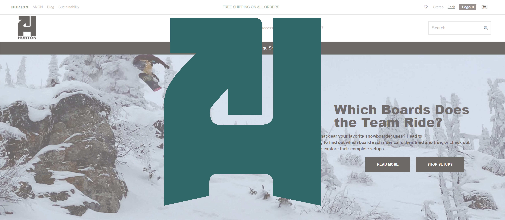
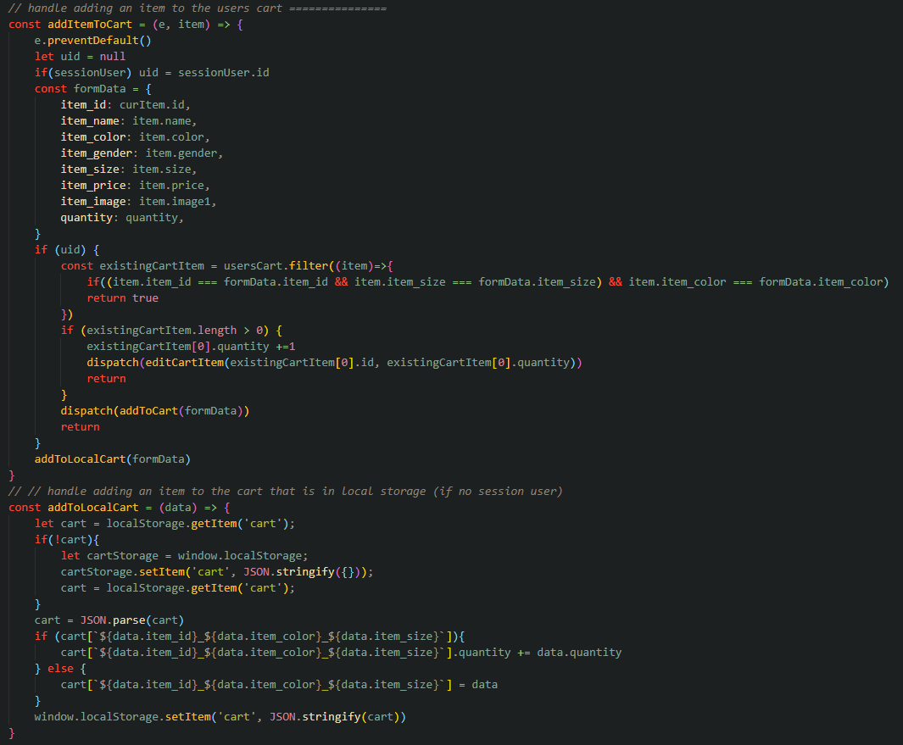

# Hurton
Clone of Burton.com by Andrew Derocher

### Overview

The Hurton project is a replica of a shopping website for snowboarders. It allows users to shop for new jackets, boots, bindings, and other snowboarding gear with or without creating an account. Account creation does open up additional features such as reviewing items, adding items to a wishlist, and saving account information for easy checkout.

### Backend
The backend is built using Flask and SQLAlchemy. There are many different components, but the main one is items

Items ended up being a very comprehensive model. Given the time constraints for the project, all of an items unique attributes are represented on this one component. Snowboards have camber and are sized in cm, and jackets have waterproofing and warmth levels and are sized in s/m/l/xl/. The single Item modal was used to encompass all of this variability. 

### Frontend
The frontend is build using a React app. one of the most interesting functions on the Hurton site is the ability for non-logged in users to shop. When an item is added to the cart, a check is done for an active user. If none is present, the item is translated to JSON and placed into local storage. This will work throughout their shopping experience, and all normal features are availble such as adjusting in-cart quantities. 

A Bonus was that if a user is mid-shopping experience, they can create a new account and their cart will be moved over into the state, and the local storage will be emptied. (If they log in, their cart will be lost and replaced with their user accounts cart).
